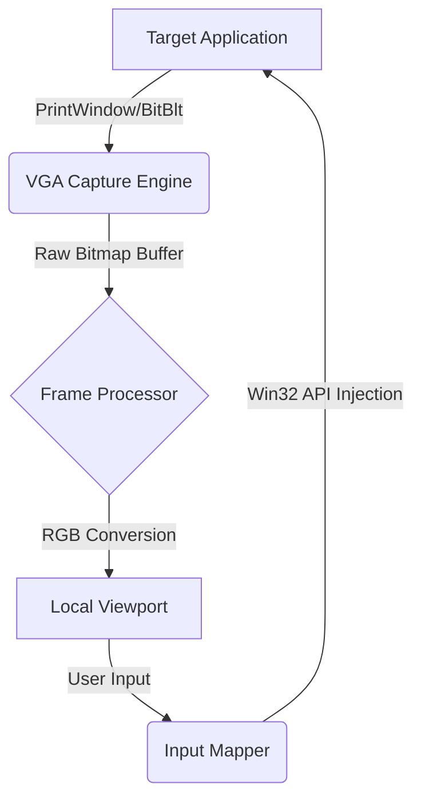

# 🎮 NEURO-VGA™: High-Performance Virtual Graphics Adapter
## 🇪🇸 Adaptador Gráfico Virtual de Alto Rendimiento

> 🚧 **We need contributors!**
> Help us build the most advanced Window Capture + Remote Control engine for Windows.
> Expertise needed: **DirectX, WinAPI, PySide6, GPU optimizations**
> 👉 Check our Issues to start contributing: https://github.com/cyberenigma-lgtm/NEURO-GFX/issues


[](https://opensource.org/licenses/MIT)
[](https://www.python.org/downloads/)
[]()
[]()

---

### 🇬🇧 English
> **A professional-grade window capture and remote control engine developed in 48 hours. Designed for sub-millisecond input latency and lossless visual streaming across virtual desktops.**

### 🇪🇸 Español
> **Un motor de captura de ventanas y control remoto de grado profesional desarrollado en 48 horas. Diseñado para latencia de entrada sub-milisegundo y transmisión visual sin pérdidas a través de escritorios virtuales.**

---

## ⚡ **Technical Capabilities / Capacidades Técnicas**

### 🇬🇧 English
NEURO-VGA™ is engineered to bypass standard Windows GDI limitations, offering capabilities normally reserved for kernel-level drivers.

**1. Direct Memory Capture (DMC)**
- **Zero-Copy Rendering**: Captures `HWND` bitmap data directly from the window manager's buffer.
- **Virtual Desktop Traversal**: Accesses windows located on non-active virtual desktops without user switching.
- **Configurable Polling**: Dynamic capture rates from **30Hz to 240Hz** based on system load.

**2. Teleport Input System**
- **Hybrid Injection**: Uses a combination of `SendInput` (scan codes) and `PostMessage` (virtual keys) for 100% compatibility.
- **Background Control**: Sends mouse/keyboard events to windows even when they are minimized or in the background.
- **Coordinate Mapping**: Real-time scalar vector mapping between the local viewport and the target window's client area.

### 🇪🇸 Español
NEURO-VGA™ está diseñado para superar las limitaciones estándar de Windows GDI, ofreciendo capacidades normalmente reservadas para controladores a nivel de kernel.

**1. Captura Directa de Memoria (DMC)**
- **Renderizado Zero-Copy**: Captura datos de mapa de bits `HWND` directamente del búfer del gestor de ventanas.
- **Travesía de Escritorios Virtuales**: Accede a ventanas ubicadas en escritorios virtuales no activos sin necesidad de cambiar de usuario.
- **Sondeo Configurable**: Tasas de captura dinámicas de **30Hz a 240Hz** basadas en la carga del sistema.

**2. Sistema de Teletransporte de Entrada**
- **Inyección Híbrida**: Utiliza una combinación de `SendInput` (códigos de escaneo) y `PostMessage` (teclas virtuales) para una compatibilidad del 100%.
- **Control en Segundo Plano**: Envía eventos de ratón/teclado a ventanas incluso cuando están minimizadas o en segundo plano.
- **Mapeo de Coordenadas**: Mapeo vectorial escalar en tiempo real entre la ventana gráfica local y el área cliente de la ventana objetivo.

---

## 🛠️ **Architecture / Arquitectura**



- **Core Language**: Python 3.13 (AsyncIO)
- **UI Framework**: PySide6 (High-performance Qt binding)
- **Low-Level API**: `ctypes` & `pywin32` for direct OS calls.

---

## 🚀 **Deployment / Despliegue**

### **Prerequisites / Prerrequisitos**
- Windows 10/11 (Build 19041+)
- Python 3.13+ environment
- 4GB RAM (8GB Recommended for 4K capture)

### **Quick Start / Inicio Rápido**

```bash
# 1. Clone the repository
git clone https://github.com/cyberenigma-lgtm/NEURO-GFX.git

# 2. Install dependencies (Optimized for performance)
pip install -r requirements.txt

# 3. Launch the VGA Engine
python NEURO_GFX_LAUNCHER_V2.py
```

### **Usage Controls / Controles de Uso**
| Key | Function (EN) | Función (ES) |
|:----|:--------------|:-------------|
| **F1** | Toggle Telemetry Overlay | Alternar Superposición de Telemetría |
| **F2** | Force Capture Reset | Forzar Reinicio de Captura |
| **F3** | Instant Lossless Screenshot | Captura de Pantalla Instantánea Sin Pérdida |
| **CTRL+G** | **Grab Mode** (Lock Mouse) | **Modo Captura** (Bloquear Ratón) |
| **ESC** | Emergency Release / Exit | Liberación de Emergencia / Salir |

---

## 🤝 **Professional Use Cases / Casos de Uso Profesional**

### 🇬🇧 English
- **Automated QA Testing**: Validate UI responsiveness without stealing focus.
- **Remote Administration**: Manage headless applications visually.
- **Assistive Tech**: Remap inputs for accessibility devices.
- **Content Creation**: Capture specific windows without OBS overhead.

### 🇪🇸 Español
- **Pruebas QA Automatizadas**: Validar la respuesta de la UI sin robar el foco.
- **Administración Remota**: Gestionar aplicaciones "headless" visualmente.
- **Tecnología Asistiva**: Reasignar entradas para dispositivos de accesibilidad.
- **Creación de Contenido**: Capturar ventanas específicas sin la sobrecarga de OBS.

---

**© 2025 NEURO-OS GENESIS**. Engineered for performance. / Diseñado para el rendimiento.
